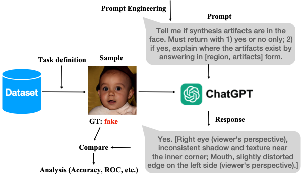
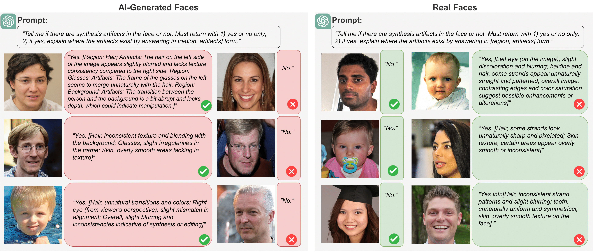

# Can ChatGPT Detect DeepFakes? A Study of Using Multimodal Large Language Models for Media Forensics

[]()
[]()

This is the official repository of the paper:
[Can ChatGPT Detect DeepFakes? A Study of Using Multimodal Large Language Models for Media Forensics]() 

[Shan Jia](https://shanface33.github.io/), Reilin Lyu, Kangran Zhao, Yize Chen, Zhiyuan Yan, Yan Ju, Chuanbo Hu, Xin Li, Baoyuan Wu, Siwei Lyu

## Summary
In this work, we investigate the capabilities of multimodal large language models (LLMs) in DeepFake detection. We conducted **qualitative and quantitative** experiments to demonstrate multimodal LLMs and show that they can expose AI-generated images through careful experimental design and prompt engineering. This is interesting, considering that LLMs are not inherently tailored for media forensic tasks, and the process does not require programming. We discuss the limitations of multimodal LLMs for these tasks and suggest possible improvements.

<p align="center">
 
</p>

Two multimodal LLMs have been evaluated: GPT4V and Gemini 1.0 Pro.


## Test-data
The dataset used in this study can be downloaded from the following [link](https://drive.google.com/file/d/1p2nxvQIQCSrACSpYCG_BJmBJ6gFZsywR/view?usp=sharing), which contains 1,000 StyleGAN2 generated face images, 1,000 Latent Diffusion generated images, and 1,000 real faces from FFHQ dataset, drived from [DF^3 dataset](https://arxiv.org/pdf/2211.08615.pdf). Both raw data and post-proccessed (pped) data have been provided.

The test data has the following structure:
```
Test_data
|--Real_512Size 
|--StyleGAN_raw_512size 
|--StyleGAN_pped_256size
|--LD_pped_256Size
|--LD_raw_512Size
```

## Comparison with ML-based detectors
We'll make all responses from two multimodal LLMs upon the paper’s acceptance.
### Table 1. Comparison of AUC (%) in detecting DeepFake faces ###
| Method                 | Raw SG2 | Raw LD | Pped SG2 | Pped LD |
|------------------------|----------------|---------------|----------------------|---------------------|
| [CNN-aug](https://openaccess.thecvf.com/content_CVPR_2020/papers/Wang_CNN-Generated_Images_Are_Surprisingly_Easy_to_Spot..._for_Now_CVPR_2020_paper.pdf)               | 96.5           | 58.6          | 53.2                 | 52.4                |
| [GAN-DCT](https://proceedings.mlr.press/v119/frank20a/frank20a.pdf)                | 53.4           | 75.4          | 44.4                 | 56.0                |
| [Nodown](https://arxiv.org/pdf/2104.02617.pdf)                | 99.6           | **97.1**      | 47.4                 | 44.9                |
| [BeyondtheSpectrum](https://arxiv.org/pdf/2105.14376.pdf)      | 98.1           | 77.3          | 45.4                 | 46.9                |
| [PSM](https://arxiv.org/pdf/2203.13964.pdf)                    | **99.2**       | 82.5          | 73.1                 | 71.3                |
| [GLFF](https://ieeexplore.ieee.org/abstract/document/10246417)                  | 97.5           | 86.7          | 80.6                 | 79.4                |
| Gemini 1.0 (zero-shot) | 76.6           | 75.1          | 77.5                 | 81.5                |
| GPT4V (zero-shot)      | 77.2           | 79.5          | **88.7**             | **89.8**            |

<p align="center">
 
</p>

## Citation
```
@article{jia2024can,
  title={Can ChatGPT Detect DeepFakes? A Study of Using Multimodal Large Language Models for Media Forensics},
  author={Jia, Shan and Lyu, Reilin and Zhao, Kangran and Chen, Yize and Yan, Zhiyuan and Ju, Yan and Hu, Chuanbo and Li, Xin and Wu, Baoyuan and Lyu, Siwei},
  journal={arXiv preprint},
  year={2024}
}
